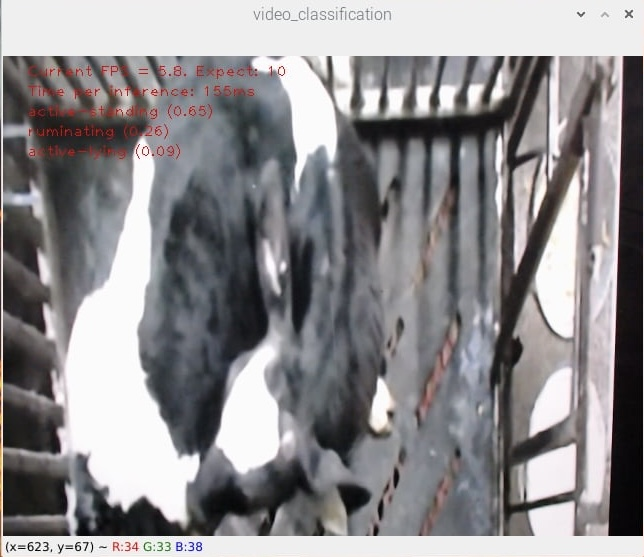

#  Running MoViNet-Stream Models on Raspberry Pi with TFLite


## 1. Download Code Example

```
git clone https://github.com/berlin0308/raspberrypi-tflite-movinet --depth 1
```

## 2. Install Python Packages

```
sh setup.sh
```

+ For model inference on Raspberry Pi, install ```tflite-runtime``` only instead of the whole ```tensorflow``` package

## 3. Run Inference

```
python3 classify.py --model models/a1_v2_stream_b16_lr0.0001_g1.5_d0.5_918/a1_float16.tflite
```

+ ```--model``` : MoViNet model path
+ ```--label``` : Path to the label map txt
+ ```--numThreads``` : CPU threads to run the model



# Model Details

| Model ID | Quantization | Model Path | Latency (RPi4 / 64-bit / 4-thread) | F1-score |
|----------|--------------|------------|---------------------------|----------|
| A0 | Int8 | models/a0_v5_stream_b16_lr0.0004_g2.0_d0.1_sd0.0_92/a0_int8.tflite | 35 ms | 0.312 |
| A0 | Float16 | models/a0_v5_stream_b16_lr0.0004_g2.0_d0.1_sd0.0_92/a0_float16.tflite | 47 ms | 0.916 |
| A1 | Int8 |  | 49 ms | 0.579 |
| A1 | Float16 |  | 98 ms | 0.918 |
| A2 | Int8 |  | 78 ms | 0.764 |
| A2 | Float16 |  | 154 ms | 0.929 |
